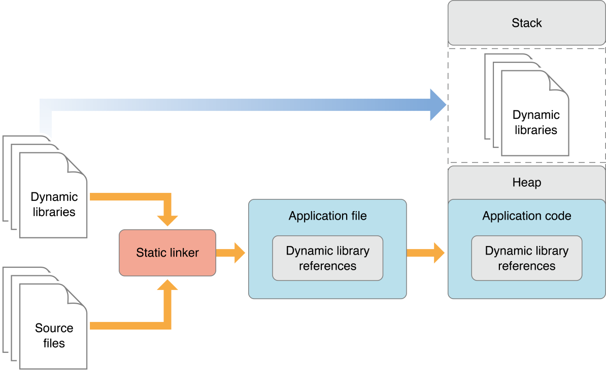

# Overview of Dynamic Libraries
Two important factors that determine the performance of apps are their launch times and their memory footprints. Reducing the size of an app’s executable file and minimizing its use of memory once it’s launched make the app launch faster and use less memory once it’s launched. Using dynamic libraries instead of static libraries reduces the executable file size of an app. They also allow apps to delay loading libraries with special functionality only when they’re needed instead of at launch time. This feature contributes further to reduced launch times and efficient memory use.

앱의 성능을 결정하는 두개의 중요한 요소는 앱의 launch time과 메모리 사용량입니다. 앱 실행 파일의 크기를 줄이는 것과 메모리 사용량을 줄이면 launch time과 메모리 사용량을 줄일 수 있습니다.이 때, static library가 아닌 dynamic library를 사용하면 앱 실행 파일의 크기를 줄일 수 있습니다.게다가 launch 시점이 아닌 필요해지는 시점에 특정 기능을 불러오는 지연로딩을 가능하게 합니다.이런 기능은 launch time을 줄이고 효율적이 메모리 사용이 가능하도록 돕습니다.

This article introduces dynamic libraries and shows how using dynamic libraries instead of static libraries reduces both the file size and initial memory footprint of the apps that use them. This article also provides an overview of the dynamic loader compatibility functions apps use to work with dynamic libraries at runtime.

이 아티클에서는 dynamic library를 소개하고 static libary 대신 dynamic lybrary를 사용하는 것이 어떻게 파일의 크기와 앱의 초기 메모리 사용량을 줄이는지를 보여줄것입니다. 또한 앱이 런타임에 dynamic library를 사용하는데 동원되는 dynamic loader의 호환성 기능에 대한 내용을 포함하고 있습니다.

Most of an app’s functionality is implemented in libraries of executable code. When an app is linked with a library using a static linker, the code that the app uses is copied to the generated executable file. A static linker collects compiled source code, known as object code, and library code into one executable file that is loaded into memory in its entirety at runtime. The kind of library that becomes part of an app’s executable file is known as a static library. Static libraries are collections or archives of object files.

앱이 가지고 잇는 대부분의 기능들은 libaray의 실행코드에 의해 구현됩니다. 앱이 static linker를 통해 libaray와 link 될 때, 앱이 사용하는 코드는 생성된 실행파일에 복사 됩니다. static linker는 object code라고 하는 컴파일된 소스코드와 libaray 코드를 런타임시에 메모리에 로드되는 하나의 실행 파일로 모읍니다. 이렇게 앱의 실행파일의 일부가 되는 libaray를 static library라고 합니다. static libary는 실행파일의 collection 혹은 archive라고 할 수 있습니다.

When an app is launched, the app’s code—which includes the code of the static libraries it was linked with—is loaded into the app’s address space. Linking many static libraries into an app produces large app executable files. Figure 1 shows the memory usage of an app that uses functionality implemented in static libraries. Applications with large executables suffer from slow launch times and large memory footprints. Also, when a static library is updated, its client apps don’t benefit from the improvements made to it. To gain access to the improved functionality, the app’s developer must link the app's object files with the new version of the library. And the apps users would have to replace their copy of the app with the latest version. Therefore, keeping an app up to date with the latest functionality provided by static libraries requires disruptive work by both developers and end users.

앱이 실행될 때 link 되어 있는 static libary들의 코드가 포함된 앱의 코드는 앱의 주소공간에 로드됩니다. 다수의 static libray들을 앱에 link하는 것은 앱 실행파일의 크기를 키웁니다. Figure 1.은 static libarary에 구현된 기능을 사용하는 앱의 메모리 사용을 도식화 한 것입니다. 큰 실행파일을 가지고 있는 어플리케이션은 긴 launch time과 큰 메모리 사용량으로 어려움을 겪게됩니다. 그리고 그런 앱의 사용자들은 그들이 가지고 있는 앱의 복사본을 최신 버전으로 교체해야만 합니다. 따라서 static library의 최신 기능으로 앱을 최신 버전으로 유지하는 것은 개발자와 사용자 모두의 불필요한 작업을 요구하게 됩니다.

A better approach is for an app to load code into its address space when it’s actually needed, either at launch time or at runtime. The type of library that provides this flexibility is called dynamic library. Dynamic libraries are not statically linked into client apps; they don't become part of the executable file. Instead, dynamic libraries can be loaded (and linked) into an app either when the app is launched or as it runs.

앱의 코드를 필요한시점에 주소(메모리)공간에 로드하는 것이 더 나은 접근법이라 할 수 있습니다. 이러한 유연성을 가지고 있는 library를 dinamic libaray라고 합니다. dynamic library는 앱에 정적으로 link되지 않습니다. (실행 파일의 일부가 되지 않습니다) 대신, dynamic library는 앱이 launch되고 난 후(런타임 중)에 앱에 로드 및 링크됩니다.

<!--  -->

**Figure 1.** App using static libraries

Figure 2 shows how implementing some functionality as dynamic libraries instead of as static libraries reduces the memory used by the app after launch.

Figure 2.는 dynamic library가 static library와는 달리 어떻게 앱이 launch되고 난 후 메모리 사용량을 줄이면서 기능들을 implement하는지를 보여줍니다.

<!--  -->

**Figure 2.** App using static libraries